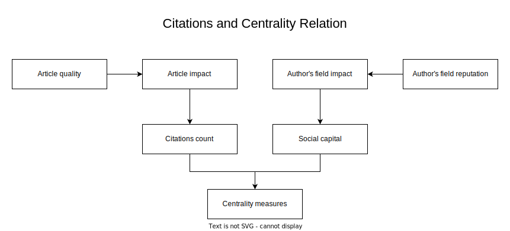

# Coauthorship Centrality

Over the past few decades, multiple factors such as the growth in the number of scientific conferences, the constant development of multiple research areas and many others, have led to an increase in the number of papers being published. This has enabled the authors to create new connections with other peers from the same or other research fields. From the network analysis point of view, the growing networking data offers an opportunity to study the macro- and micro-level properties of the authors and their impact.

The proposed approach uses centrality measures in order to extract information about the authors and collaborator groups in co-authorship networks, in this case networks derived from the publication data of the [SYNASC](https://synasc.ro/) conference. Ultimately, the goal is to study the overall impact of the collaborator groups generated by their research and also their impact on the conference itself, from multiple perspectives.

## Paper - Authors and Collaborator Groups Ranking Analysis on SYNASC using Centrality Measures

The proposed algorithms and techniques presented in [Authors and Collaborator Groups Ranking Analysis on SYNASC using Centrality Measures](https://ieeexplore.ieee.org/abstract/document/10130959) have the main goal of providing tools for analysing the overall impact of collaborator groups in their research field and their impact on conferences, from different points of view. This work focuses solely on the SYNASC conference. The research was conducted by [Victor Bogdan](https://scholar.google.com/citations?user=eeKVSEwAAAAJ&hl=en&oi=ao) and [Alin Brindusescu](https://scholar.google.com/citations?user=TtxluZMAAAAJ&hl=en&oi=ao) with the paper being presented at the SYNASC 2022 conference.

### Methodology

Our approach is rooted in the principles of additive centrality measures and [Shapley Value](https://www.rand.org/pubs/papers/P295.html), with the latter requiring an adaptation of the context in order to accommodate the integration of techniques from game theory. By representing the data as a multilayered network, we can regard each layer as an agent, thereby adapting our context by creating a game between these layers. In order to compute the contribution of each layer to a specific node, we can conceive of all layers as forming a coalition. The initial contribution of each layer is established through the application of centrality measures to the layers of the multilayered network. Through the computation of the Shapley Value, we will obtain a vector of values which represents the contribution (centrality) of each layer in relation to a node. Consequently, similar to the case of centrality measure functions for single-layered networks, which determine the centrality of nodes, our approach can be utilized to determine the centrality of layers within a multilayered network.

The additive centrality measures which we have used are:
- [Degree centrality](https://networkx.org/documentation/stable/reference/algorithms/generated/networkx.algorithms.centrality.degree_centrality.html), which quantifies the number of edges a node has in a network.
- [Katz centrality](https://networkx.org/documentation/stable/reference/algorithms/generated/networkx.algorithms.centrality.katz_centrality.html), which calculates the centrality of a node based on the sum of the weights of the paths between the node and all other nodes in the network.
- [Subgraph centrality](https://networkx.org/documentation/stable/reference/algorithms/generated/networkx.algorithms.centrality.subgraph_centrality.html), which evaluates the importance of a node by counting the number of subgraphs that include that node.
- [Harmonic centrality](https://networkx.org/documentation/stable/reference/algorithms/generated/networkx.algorithms.centrality.harmonic_centrality.html), which assesses the importance of a node by computing the sum of the harmonic mean of the distances of that node to all other nodes in the network.

Consequently, two different types of co-authorship networks were constructed:
- Author co-authorship networks, built by adding a unique node for each participant author and edges between the author and his co-authors.
- Collaborator group co-authorship networks, where the nodes in the co-authorship networks are represented by collaborator group and each group is uniquely represented by a set of co-authors and their published papers. Edges are added between collaborator groups which have at least one common author.

<ins>Note</ins>:
Each **collaborator group** is uniquely represented by a set of co-authors and their published papers. In case one or more authors of any given group have published a paper with another author, they form together another unique group. Thus, an author can be part of multiple collaborator groups and each group can have multiple published papers.

The centrality measures have proven to be a useful concept for analysing different types of social networks. Each centrality measure has its own definition and thus offers a different perspective about the meaning of how central a node is in a network. By using the previously described centrality measures, we are studying the micro-level structure of the networks. Thus, the centrality measures which we have used and the resulting rankings, offer valuable insights regarding the diversity, efficiency, frequency and productivity of the authors and collaborator groups.

### Remarks

This work is an extension of [Applying centrality measures to impact analysis: A coauthorship network analysis](https://onlinelibrary.wiley.com/doi/10.1002/asi.21128), where the authors propose a micro-level analysis of author rankings using centrality measures with the goal of conducting an impact analysis. In our approach we use a similar centrality measure based approach for ranking collaborator groups, in order to offer valuable information about the influence of those groups on scientific conferences and we compare it with the author analysis on the same dataset.

In the academic world, the citation count of an author is widely considered as a good measure of the impact and quality, which the author has in his fields of study and as a researcher overall. The authors of [Applying centrality measures to impact analysis: A coauthorship network analysis](https://onlinelibrary.wiley.com/doi/10.1002/asi.21128) argue that "centrality has its value in impact evaluation, since it integrates both article impact andauthor’s field impact". Their results also highlight a correlation between the rankings obtained by using centrality measures and those obtained based on the citation count. By conducting a similar author analysis on our dataset, we have also obtained a moderate correlation between the two types of rankings.

Regarding the collaborator groups rankings, we obtained weak correlations between the rankings computed using the centrality measures and those based on the citation count. Therefore, one could use the centrality measures in order to analyse the micro-level properties of co-authorship networks, in order to determine from which point of view some of the authors or collaborator groups excelled. On the other hand, for an overall impact analysis, in the case of the collaborator groups, some other complementary techniques might be required as well.

## Dataset

The dataset which we have used, was constructed dynamically using conference data, which fetched from the [DBLP](https://dblp.org/) computer science bibliography website, with the help of the API wrapper tool provided by [DataPrep](https://dataprep.ai/).

<ins>Note</ins>: The data fetched from DBLP does not contain any information regarding the citation count and there is no guarantee that the obtained dataset represents the complete set of publications at the respective conference.
